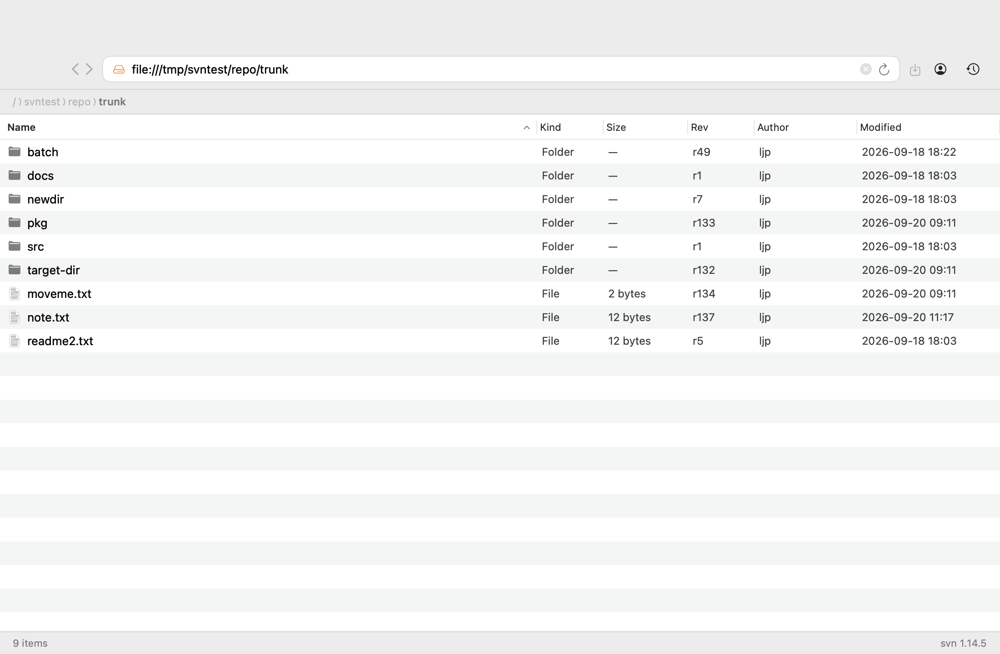
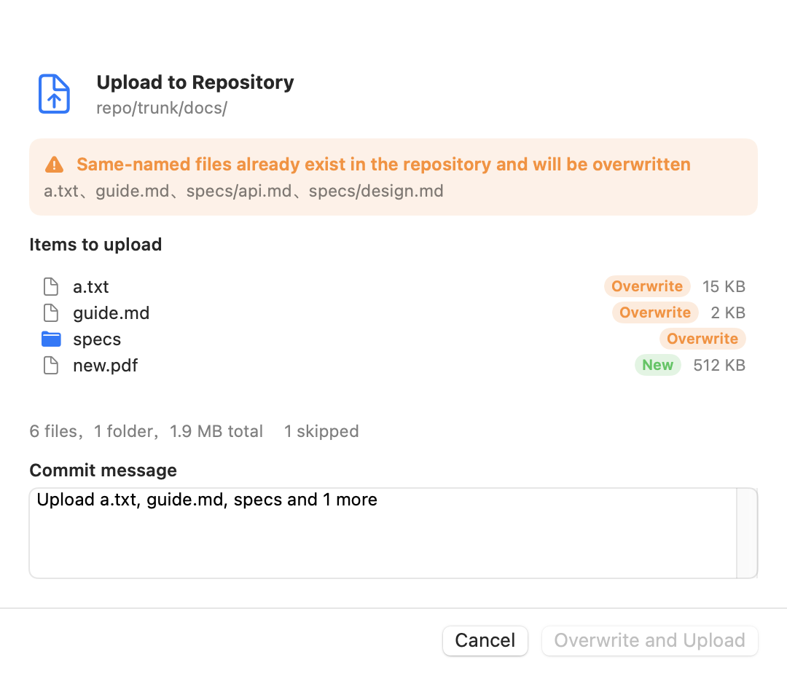
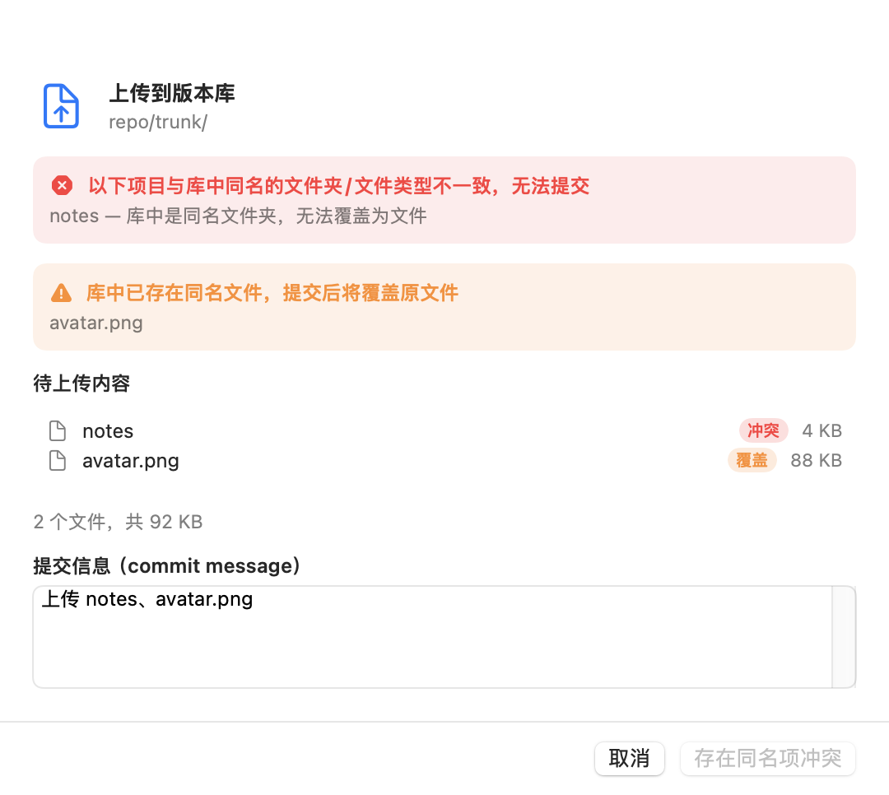
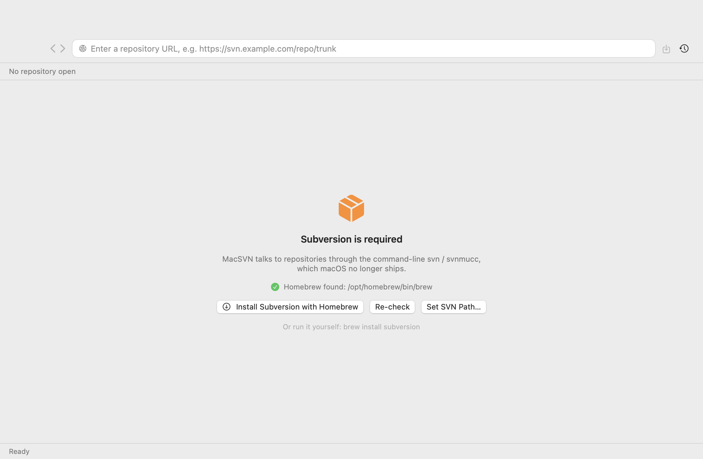
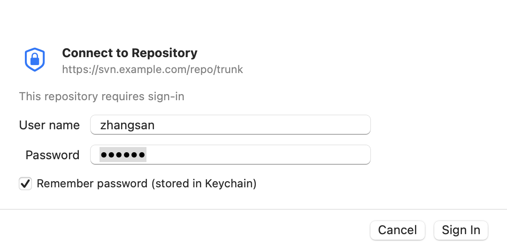

# MacSVN

[简体中文](README.zh-CN.md) | **English**

A Subversion client for macOS with a browser-like interface: an address bar, back/forward, breadcrumbs, a directory listing, and drag & drop for upload and download.

- **Bilingual UI** — English and Simplified Chinese, following your system language
- **No third-party libraries** — pure Swift (SwiftUI + AppKit)
- **No working copy needed** — it drives the command-line `svn` / `svnmucc`, never touches a checkout
- **Upload = overwrite** — uploads go through `svnmucc put`, so a single command both creates and overwrites; name clashes are flagged before you commit
- **Installs its own dependency** — if Subversion is missing, the app walks you through installing it with Homebrew





When an item clashes with a same-named item of a different kind (a file where the repository has a folder), the commit is blocked up front:



## Features

| Feature | Notes |
| --- | --- |
| One-click dependency setup | If `svn` is missing, the first screen offers to install it with Homebrew (streaming log inside the app) and re-checks when done; if Homebrew is missing too, it opens Terminal with a ready-made script |
| Open a repository | Type `https://`, `svn://`, `svn+ssh://` or `file://` in the address bar and press Return; a bare host gets `https://` |
| Authentication | A sign-in sheet appears when the server requires it; untrusted TLS certificates can be trusted explicitly |
| Remembered login | A successful sign-in is kept in the Keychain for **30 days**, so later launches open the repository without asking. The password is only stored after the server accepts it. After 30 days, or after you log out, you are asked again |
| Log out | Toolbar person icon → Log Out (or MacSVN › Log Out) deletes the saved login for the current server immediately |
| Browsing | Name, kind, size, revision, author and date; folders first; click a column header to sort |
| Readable addresses | The address bar and breadcrumbs show decoded paths (`tags/其他`), while requests stay percent-encoded — the displayed address can be copied and re-opened as is |
| Navigation | Double-click to enter, `⌘[` / `⌘]` back and forward, `⌘↑` for the enclosing folder, clickable breadcrumbs |
| Rename | Select one item → `⌘E` or right-click → Rename…, with a commit message |
| Delete | Select and press `Delete` or `⌘⌫`; one commit can remove several items |
| Drag out | Drag files or folders straight to Finder or another app; they are exported from the repository on demand |
| Drag in to upload | Drag from Finder onto the list (or onto a specific folder row), confirm in a dialog with a commit message |
| Name clashes | Same-named files are highlighted as “Overwrite” and listed explicitly; “Overwrite and Upload” replaces them |
| Type conflicts | A file vs. a same-named folder (or the reverse) cannot be committed — the dialog says so and disables the button |
| Drag inside the app | Drag a row onto a folder row to move it server-side (`svnmucc mv`), same confirmation dialog |
| Download | `⌘S` downloads the selection, or double-click a file to export and open it |
| New folder | `⇧⌘N` creates a folder at the current location |
| Context menu | Open, Download, Rename, Delete, Copy Link, New Folder, Refresh |
| Recents | Recently opened repositories live behind the clock icon in the toolbar |

## Requirements

- macOS 13 or later
- Subversion (`svn` and `svnmucc`)

**You do not need to install Subversion yourself.** The app checks at launch; if it is missing you get the screen below, and “Install Subversion with Homebrew” runs `brew install subversion` for you, streaming the log and re-checking when it finishes.



If Homebrew is missing as well, the button becomes “Install Homebrew (opens Terminal)” — installing Homebrew needs an administrator password, so it has to happen in Terminal. The app writes a `.command` script (avoiding any need for automation permissions) that also handles the Apple-silicon `brew shellenv` step and runs `brew install subversion` right after; when it is done, click “Re-check” in the app.

The install looks like this:


The app looks for `svn` in `/opt/homebrew/bin`, `/usr/local/bin`, `/opt/local/bin`, `/usr/bin` and friends, then falls back to your login shell's `PATH`. You can also point it at a folder manually via “MacSVN › Set SVN Path…” or “MacSVN › Install Subversion…”.

## Download and install

Grab the latest `MacSVN-<version>-macOS.zip` from the [Releases](https://github.com/Jas0nxlee/MacSVN/releases) page, then:

1. **Unzip** it to get `MacSVN.app`
2. **Drag `MacSVN.app` into your Applications folder**
3. **The first launch is blocked by macOS** with “unidentified developer” or “Apple cannot check it for malicious software”. The app is signed ad-hoc with no Apple Developer ID, so this is expected. Pick either fix:

   ```bash
   xattr -dr com.apple.quarantine /Applications/MacSVN.app
   ```

   Or double-click once to trigger the block, then open **System Settings → Privacy & Security**, find MacSVN in the list, and click **Open Anyway**. (Since macOS 15 there is no “right-click → Open” shortcut any more.)
4. **On first run**, if Subversion is missing, click “Install Subversion with Homebrew” and the app takes care of it — including installing Homebrew itself if needed.

Common questions:

- **Don't run it straight from the zip** — the extracted app needs proper permissions; unzip and move it to Applications first.
- **“MacSVN is damaged and can't be opened”** — almost always the quarantine attribute; use the terminal command in step 3.
- **Apple silicon and Intel both work** — the release is a universal binary (arm64 + x86_64).
- **Verifying the download** — the release notes include a SHA256; compare with `shasum -a 256 MacSVN-<version>-macOS.zip`.

## Build from source

```bash
./scripts/build-app.sh                     # build dist/MacSVN.app for this machine
./scripts/build-app.sh release universal   # universal binary (Apple silicon + Intel)
open dist/MacSVN.app
```

Or with SwiftPM directly:

```bash
swift build -c release
swift run
```

## Usage

1. Type a repository URL (for example `https://svn.example.com/repo/trunk`) into the address bar and press Return.
2. If the repository needs authentication, a sign-in sheet appears. “Remember login for 1 month” is on by default — the credential is stored in the Keychain once the server accepts it, and the next launch opens the repository silently. Untick it if you'd rather type the password every time. The sheet also shows when the saved login expires, with a **Remove** button to delete it on the spot.


3. Double-click folders to enter them; drag files in from Finder to upload.
4. The confirmation dialog marks every item as **New** or **Overwrite**, and same-named files in the repository are listed explicitly.
5. Select items and press `Delete` to remove, `⌘E` to rename, `⌘S` to download — or just drag them to Finder.

### About credentials

- A successful sign-in is saved in the system Keychain with a 30-day lifetime; expired entries are deleted automatically the next time they are read. Only credentials the server accepted are saved — a wrong password is never stored.
- Log in as a different user any time with **MacSVN › Log Out**: it removes the saved credential for the current server and asks again on the next request.
- The app also honours your `~/.subversion` configuration and credential cache: if you have signed in to the same server with the command-line client before, the app may not ask again. That is intentional.

### Permissions

The app is not sandboxed (it needs to run `svn` and read/write local files). The first time you drag a file into a protected folder such as Desktop, Documents or Downloads, macOS may ask for permission once.

## Project layout

```
Sources/MacSVN/
  main.swift              entry point, window, menus
  BrowserModel.swift      app state: navigation, sign-in, upload/overwrite, rename, delete
  SVNClient.swift         svn / svnmucc process handling, XML parsing, error classification
  UploadPlanner.swift     local recursion, ignore rules, clash detection, svnmucc action planning
  FileTableView.swift     the file list (NSTableView wrapper): drag out, drop in, context menu, keys
  BrowserView.swift       browser chrome: toolbar, address bar, breadcrumbs, status bar
  Sheets.swift            sign-in / upload / rename / delete / install dialogs
  HomebrewInstaller.swift locate brew, stream `brew install`, generate the Terminal script
  CredentialStore.swift   Keychain access
  Support.swift           path and formatting helpers
  SelfTest.swift          hidden self-test: --selftest
  HeadlessScenario.swift  hidden UI-flow runs: --headless-upload / --headless-op / --headless-move / --headless-login
  RenderUI.swift          hidden renderer: --render-ui (dumps the UI to PNG)
Resources/
  en.lproj/               base localization (English) + plural rules
  zh-Hans.lproj/          Simplified Chinese
scripts/
  build-app.sh            compile and assemble the .app
  regression.sh           end-to-end regression suite (creates a repo and an authenticated server)
  release.sh              build a universal binary and publish a GitHub release
  make-icon.swift         generate AppIcon.icns
  Info.plist              bundle description
```

## Implementation notes

- **Upload and overwrite** use `svnmucc put <local> <url>`, which both creates and overwrites. Directories that need to exist are created with `mkdir` in the same transaction, so one confirmation produces one revision. The action list is generated in `FileManager` pre-order, which guarantees every `mkdir` precedes the `put`s inside it.
- **Clash detection** lists the target folder first. If you drop a folder that already exists in the repository, its subtree is fetched recursively, so the dialog shows an exact, file-level list of what will be overwritten — while existing directories are merged rather than recreated.
- **Type conflicts** compare names *and* kinds. A local file against a remote directory (or the reverse) is a hard conflict: no actions are generated and the confirm button is disabled. Only file-vs-file counts as an overwritable clash.
- **Chunked commits** split the action list every 300 items. Because `mkdir` always precedes the `put`s it contains, a chunk boundary can never orphan a file — the parent directory was committed earlier.
- **Ignore rules** follow svn's default `global-ignores` (`.DS_Store`, `*.o`, `*~`, …) plus `.svn`, `.git` and symbolic links; skipped items are reported in the dialog.
- **Drag out** uses `NSFilePromiseProvider`: nothing is downloaded until Finder actually writes the file, at which point the app runs `svn export`.
- **Passwords** are passed with `--password-from-stdin` rather than `--password`, so they never show up in the process list. `LC_ALL=en_US.UTF-8` keeps svn's error codes parseable and non-ASCII file names intact.
- **Errors** are classified from svn's exit codes (`E170001` authentication, `E230001` certificate, `E160013` path not found, …) and mapped to actionable UI — an authentication failure reopens the sign-in sheet instead of showing a generic error.
- **Localization** uses English source strings as keys (`NSLocalizedString`), with `zh-Hans.lproj/Localizable.strings` for Chinese and a `Localizable.stringsdict` for English plural rules. Anything other than English or Chinese falls back to English.

## Regression tests

```bash
./scripts/regression.sh
```

The script creates a throwaway repository and an authenticated `svnserve` on a random port (so no Keychain entry can interfere), then runs 28 checks: two core self-tests (`file://` and authenticated `svn://`), upload / overwrite / upload-into-subfolder, moving files and folders inside the repository, conflict blocking, rename, delete, Keychain storage (save, 30-day expiry, deletion), the Homebrew install path, and the full sign-in lifecycle — first visit prompts, a successful sign-in is remembered, the next visit opens silently, logging out clears it, and the visit after that prompts again (wrong passwords are rejected and never stored), and path encoding/decoding for Chinese and space-containing paths. It cleans up the server and its credentials afterwards.

## Self-tests and debugging

```bash
# full round trip against a real repository: upload / overwrite / rename / delete
MacSVN.app/Contents/MacOS/MacSVN --selftest file:///tmp/svnrepo
MacSVN.app/Contents/MacOS/MacSVN --selftest svn://host/repo user pass

# drive the real UI flow (open → drop → confirm dialog → commit → verify)
MacSVN.app/Contents/MacOS/MacSVN --headless-upload <repoURL> <targetSubfolder|-> <local files...>
MacSVN.app/Contents/MacOS/MacSVN --headless-op <repoURL> rename <newName> <item>
MacSVN.app/Contents/MacOS/MacSVN --headless-op <repoURL> delete <item>
MacSVN.app/Contents/MacOS/MacSVN --headless-move <repoURL> <item> <targetFolder>
MacSVN.app/Contents/MacOS/MacSVN --headless-login <repoURL> <user> <password>
MacSVN.app/Contents/MacOS/MacSVN --headless-open <repoURL> <prompt|silent>   # assert whether a sign-in sheet appears
MacSVN.app/Contents/MacOS/MacSVN --headless-logout <repoURL>

# Keychain storage: save / 30-day expiry / deletion
MacSVN.app/Contents/MacOS/MacSVN --selftest-credentials

# address encoding/decoding (display vs. request form)
MacSVN.app/Contents/MacOS/MacSVN --selftest-paths

# render the UI to PNG (useful without screen-recording permission)
MacSVN.app/Contents/MacOS/MacSVN --render-ui /tmp/macsvn-ui <repoURL>
MacSVN.app/Contents/MacOS/MacSVN -AppleLanguages '(zh-Hans)' --render-ui /tmp/out <repoURL>

# Homebrew install flow (really runs brew install; prints "already installed" if present)
MacSVN.app/Contents/MacOS/MacSVN --selftest-brew [formula]
```

Environment switches used by the self-tests to simulate a machine that is missing dependencies:

```bash
MACSVN_TEST_NO_SVN=1 MacSVN.app/Contents/MacOS/MacSVN   # pretend svn is not installed
MACSVN_TEST_NO_BREW=1 MacSVN.app/Contents/MacOS/MacSVN  # pretend Homebrew is not installed
```

## Known limitations

- Dragging out uses a file promise, so the destination is decided by Finder; large files take a while to export.
- Dragging inside the app *moves* items rather than copying them; it refuses to overwrite an existing name.
- A file cannot overwrite a same-named folder in the repository (or the reverse) — rename first.
- No log viewer, diff viewer or conflict resolution: this covers everyday browsing, uploading, overwriting, renaming and deleting.

## Publishing a release (maintainers)

```bash
./scripts/release.sh 1.0.1
```

It builds a universal binary, assembles the `.app`, compresses it with `ditto` (preserving the bundle structure), computes the SHA256, then creates the tag and uploads the zip through `gh release create`, with install steps and the checksum in the release notes. Requires a clean working tree and a signed-in `gh`.

## License

[MIT](LICENSE)
