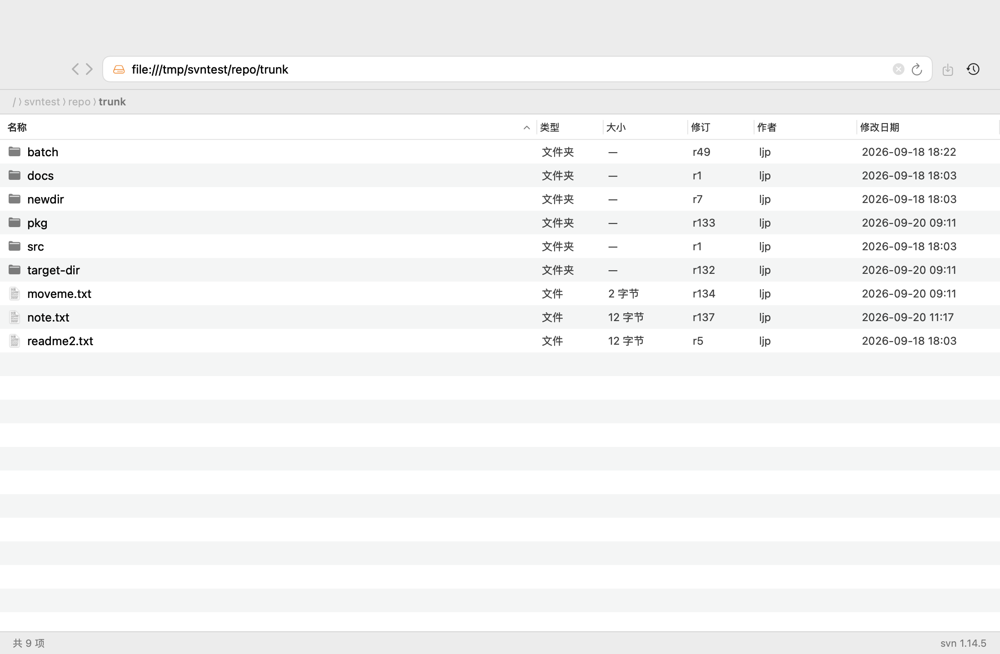
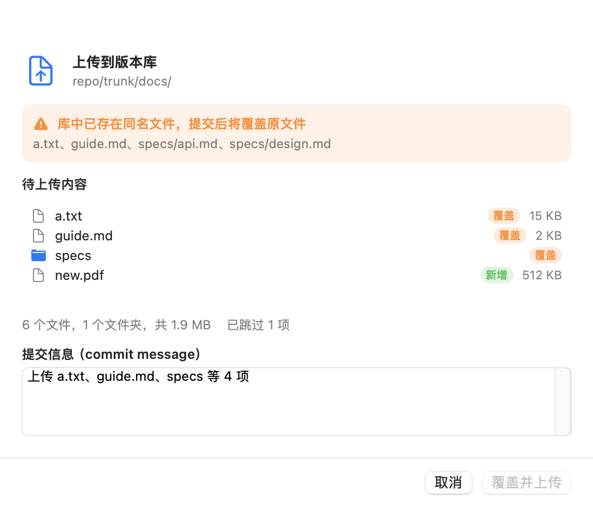
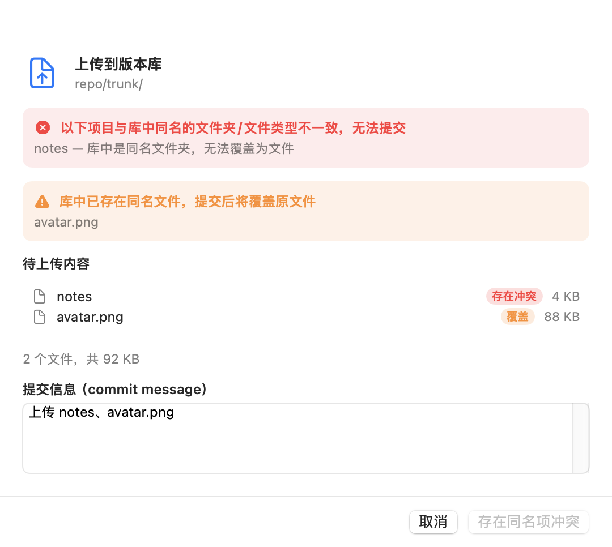
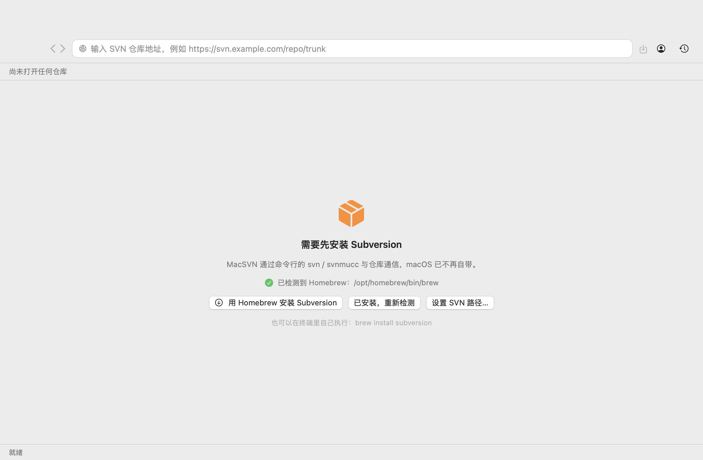
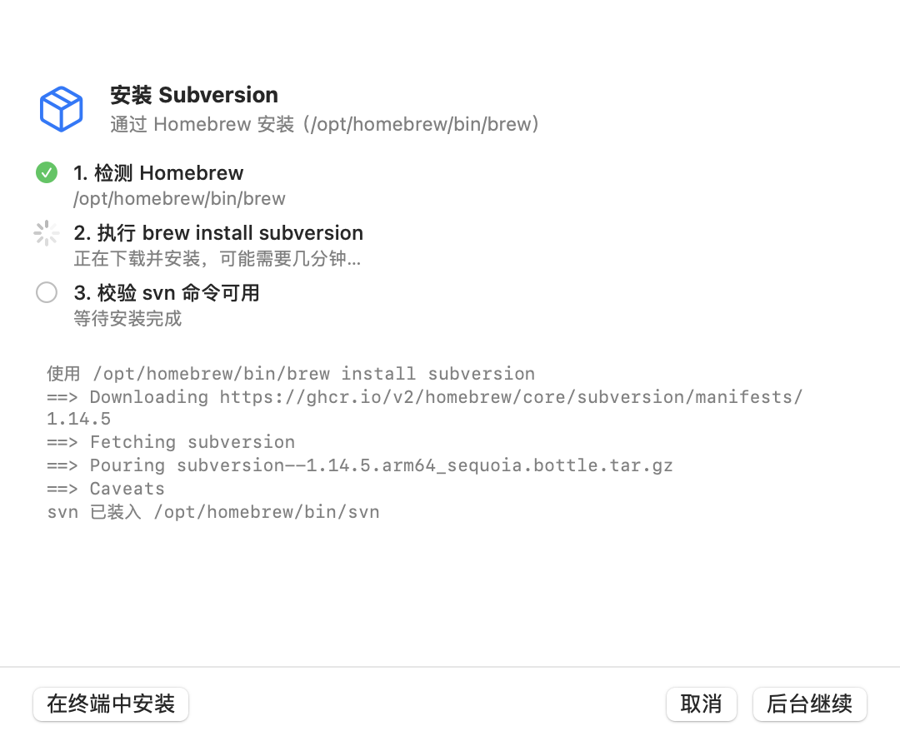
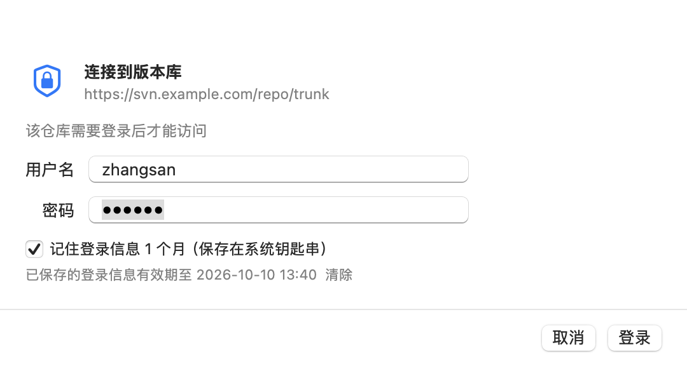

# MacSVN

**简体中文** | [English](README.md)

macOS 上的 Subversion 图形客户端：浏览器式界面（地址栏、前进后退、面包屑）、目录浏览、拖拽上传下载、重命名与删除。

- 界面支持简体中文与英文，跟随系统语言自动切换
- 纯 Swift 实现（SwiftUI + AppKit），不依赖任何第三方库
- 底层调用命令行 `svn` / `svnmucc`，不改动你的工作副本，也不需要先 checkout
- 上传走 `svnmucc put`，同一条命令既能新建也能覆盖；重名会先提示，确认后覆盖
- 机器上没有 Subversion 时，应用内引导用 Homebrew 一键安装





遇到同名文件夹等无法覆盖的情况会直接拦下：



## 功能

| 功能 | 说明 |
| --- | --- |
| 一键装依赖 | 机器上没有 svn 时，首屏直接引导用 Homebrew 安装（应用内流式显示安装日志），装完自动重新检测；连 Homebrew 都没有时改为打开终端引导安装 |
| 打开仓库 | 地址栏输入 `https://` / `svn://` / `svn+ssh://` / `file://` 地址，回车打开；省略协议时默认补 `https://` |
| 账户验证 | 访问受保护的仓库时弹出登录框；证书不受信任时可勾选信任该服务器 |
| 记住登录 | 登录成功后把账号密码存入系统钥匙串，**有效期 30 天**，期间再次打开无需输入；只有服务端验证通过的凭据才会保存，30 天到期或主动注销后需重新登录 |
| 退出登录 | 工具栏人像图标 → 退出登录（或菜单「MacSVN › 退出登录」），立即清除当前服务器保存的登录信息 |
| 目录浏览 | 显示名称、类型、大小、修订版本、作者、修改日期；文件夹优先排序，点表头可切换排序 |
| 进入 / 返回 | 双击文件夹进入，`⌘[` `⌘]` 前后退，`⌘↑` 上一级，面包屑可点击跳转 |
| 重命名 | 选中一项 → `⌘E` 或右键"重命名…"，填写新名称与提交信息 |
| 删除 | 选中后按 `Delete` 键或 `⌘⌫`，确认框内填写提交信息，一次提交可删多项 |
| 拖出到外部 | 把库里的文件/文件夹直接拖到访达或其它 App，会按需从仓库导出 |
| 拖入上传 | 从访达拖文件/文件夹到列表（可拖到某个文件夹行上），弹确认框，填写 commit 信息后提交 |
| 重名处理 | 拖入时若库中已有同名文件，确认框会用橙色标注"覆盖"并列出所有会被覆盖的路径；点击"覆盖并上传"后原文件被覆盖 |
| 类型冲突 | 库里已有同名**文件夹**而拖入的是文件（或反过来）时，确认框用红色标出并禁用提交按钮，避免提交到一半失败 |
| 大批量上传 | 单次超过 300 个文件时自动分批提交，逐批生成版本号 |
| 库内拖动 | 把一行拖到另一个文件夹行上，做服务端移动（`svn mucc mv`），同样弹确认框与提交信息 |
| 下载 | `⌘S` 下载所选到本地，或双击文件自动导出并用默认程序打开 |
| 新建文件夹 | `⇧⌘N` 在当前位置创建目录 |
| 右键菜单 | 打开 / 下载 / 重命名 / 删除 / 拷贝链接 / 新建文件夹 / 刷新；在文件夹行上右键还会多出「在“X”中新建文件夹…」，直接建在该文件夹里 |
| 最近仓库 | 工具栏时钟图标里保存最近打开的仓库地址 |

## 环境要求

- macOS 13 或更高
- Subversion 命令行工具（`svn` 与 `svnmucc`）

**没有装 Subversion 也能直接用**：应用启动时会检测，缺失时首屏给出引导（见图），点「用 Homebrew 安装 Subversion」就会在应用内执行 `brew install subversion`，安装日志实时滚动显示，装完自动重新检测并提示可直接使用。



连 Homebrew 也没有时，引导会改成「安装 Homebrew（打开终端）」——Homebrew 安装需要管理员密码，只能在终端里完成。应用会生成一个 `.command` 脚本交给终端执行（避免申请"控制终端"的自动化权限），脚本里同时带上 Apple 芯片的 `brew shellenv` 处理与随后的 `brew install subversion`，装完回到应用点「已安装，重新检测」即可。

安装过程长这样：



App 会在 `/opt/homebrew/bin`、`/usr/local/bin`、`/opt/local/bin`、`/usr/bin` 等位置查找 `svn`，找不到时再从登录 shell 的 `PATH` 找一次；也可以用菜单「MacSVN › 安装 Subversion…」或「设置 SVN 路径…」手动处理。

## 下载安装（不需要自己编译）

到 [Releases](https://github.com/Jas0nxlee/MacSVN/releases) 页面下载最新的 `MacSVN-<版本>-macOS.zip`，然后：

1. **解压**压缩包，得到 `MacSVN.app`
2. 把 `MacSVN.app` **拖进「应用程序」文件夹**
3. **首次打开**会被 macOS 拦下，提示"无法验证开发者"或"Apple 无法检查其是否包含恶意软件"——因为这个应用没有 Apple 开发者签名（ad-hoc 签名），属于预期现象。任选一种方式放行：

   ```bash
   xattr -dr com.apple.quarantine /Applications/MacSVN.app
   ```

   或者：先双击一次让它被拦下，然后打开「系统设置 → 隐私与安全性」，在下方找到被拦下的 MacSVN，点「仍要打开」。
   （macOS 15 起已经没有"右键 → 打开"这条快捷放行方式了。）
4. **打开后**如果提示缺少 Subversion，点「用 Homebrew 安装 Subversion」，应用会自己调 brew 装好；连 Homebrew 都没有时，它会引导你在终端里安装。

几个常见问题：

- **不要直接在压缩包里双击运行**：zip 里的应用缺少正确的权限，先解压并拖到「应用程序」再运行。
- **提示"已损坏，无法打开"**：多半就是 quarantine 属性导致的，执行第 3 步终端命令即可。
- **Intel 与 Apple 芯片都能用**：Release 里是通用二进制（arm64 + x86_64）。
- **校验下载**：Release 说明里附有 zip 的 SHA256，可用 `shasum -a 256 MacSVN-<版本>-macOS.zip` 对比。

## 从源码构建与运行

```bash
./scripts/build-app.sh                     # 编译并生成 dist/MacSVN.app
./scripts/build-app.sh release universal   # 通用二进制（Apple 芯片 + Intel）
open dist/MacSVN.app
```

也可以直接用 SwiftPM：

```bash
swift build -c release
swift run
```

## 使用说明

1. 地址栏输入仓库地址（例如 `https://svn.example.com/repo/trunk`），回车。
2. 若仓库需要认证，会弹出登录框；"记住登录信息 1 个月"默认勾选，服务端验证通过后即写入钥匙串，下次打开直接进入。对话框里还会显示已保存登录信息的到期时间，旁边有「清除」按钮可立即删除。


3. 双击文件夹进入；从访达拖文件进来即可上传，确认框里能看到每个文件是"新增"还是"覆盖"。
4. 库里已有的同名文件会被标注出来，确认后覆盖原文件并生成一个新版本。
5. 选中条目后按 `Delete` 删除、`⌘E` 重命名、`⌘S` 下载，或直接拖到访达。

### 关于凭据

- 登录成功后会保存到系统钥匙串，有效期 30 天，过期条目在下次读取时自动清理；密码错误的凭据不会被保存。
- 想换账号时用菜单「MacSVN › 退出登录」，会立即清除当前服务器的登录信息，下次请求重新要求输入。
- 同时沿用 `~/.subversion` 的配置与凭据缓存：如果你之前用命令行 `svn` 登录过同一台服务器，App 打开时可能不再询问密码，这是预期行为。

### 权限提示

App 未启用沙盒（需要调用 `svn` 并读写本地文件）。首次把文件拖到"桌面""文稿""下载"等受保护目录时，macOS 可能弹出一次授权提示，允许即可。

## 目录结构

```
Sources/MacSVN/
  main.swift              入口、窗口、菜单
  BrowserModel.swift      应用状态：导航、登录、上传/覆盖、重命名、删除
  SVNClient.swift         svn / svnmucc 进程调用、XML 解析、错误分类
  UploadPlanner.swift     本地递归枚举、忽略规则、重名检测、svnmucc 动作生成
  FileTableView.swift     目录列表（NSTableView 包装）：拖出、拖入、右键菜单、键盘
  BrowserView.swift       浏览器式界面：工具栏、地址栏、面包屑、状态栏
  Sheets.swift            登录 / 上传确认 / 重命名 / 删除 确认框
  HomebrewInstaller.swift 定位 brew、流式执行 brew install、生成终端安装脚本
  CredentialStore.swift   钥匙串读写
  Support.swift           路径与格式化工具
  SelfTest.swift          隐藏自检：--selftest
  HeadlessScenario.swift  隐藏演练：--headless-upload / --headless-op / --headless-move / --headless-login
  RenderUI.swift          隐藏渲染：--render-ui（把界面导出成 PNG）
Resources/
  en.lproj/               基础本地化（英文）+ 复数规则
  zh-Hans.lproj/          简体中文
scripts/
  build-app.sh            编译并组装 .app
  regression.sh           端到端回归测试（自动建仓库 + 认证服务）
  release.sh              构建通用二进制并发布 GitHub Release
  make-icon.swift         生成 AppIcon.icns
  Info.plist              Bundle 描述
```

## 实现要点

- **上传与覆盖**：通过 `svnmucc put 本地文件 目标URL` 实现，同一条命令既能新建也能覆盖；需要新建的目录用 `mkdir` 动作，多个动作在**一次提交**里完成，产生一个版本号。目录层级按 `FileManager` 的前序遍历生成，保证 `mkdir` 一定排在对应的 `put` 之前。
- **重名检测**：拖入前先列出目标目录；如果拖入的是库里已存在的文件夹，会再递归列出该子树的路径，因此确认框里列出的是**精确到文件**的覆盖清单。目录已存在时按"合并"处理，不会重复 `mkdir`。
- **分批提交**：动作按 `FileManager` 前序遍历生成，`mkdir` 永远排在对应 `put` 之前，因此按每 300 个动作切分成多次提交时，父目录总是在更早的提交里就已存在。
- **同名类型冲突**：规划阶段同时比对名字与类型。库里是目录、本地是文件（或反之）属于硬冲突，既不生成动作也禁用确认按钮；只有"文件对文件"才是可覆盖的重名。
- **忽略规则**：沿用 svn 默认的 `global-ignores`（`.DS_Store`、`*.o`、`*~` 等），并额外跳过 `.svn`、`.git` 等版本控制目录与符号链接，跳过的内容会在确认框里提示。
- **拖出到访达**：使用 `NSFilePromiseProvider`，访达真正落盘时才用 `svn export` 把文件导出到目标位置。
- **密码传递**：使用 `--password-from-stdin` 而不是 `--password`，避免密码出现在进程参数里；同时固定 `LC_ALL=en_US.UTF-8` 以保证错误码解析稳定、中文文件名正常。
- **本地化**：源码里的英文字符串就是 key（`NSLocalizedString`），中文放在 `zh-Hans.lproj/Localizable.strings`，英文复数规则放在 `Localizable.stringsdict`；英文与中文之外的语言回落到英文。
- **错误处理**：解析 svn 的错误码（`E170001` 认证、`E230001` 证书、`E160013` 路径不存在等）映射成中文提示与对应操作（例如认证失败直接弹登录框而不是一个通用报错）。

## 回归测试

```bash
./scripts/regression.sh
```

脚本会自动建一个临时仓库、起一个带认证的 `svnserve`（随机端口，避免命中钥匙串缓存），然后跑完 31 项检查：核心自检 ×2（file:// 与 svn:// 认证）、拖入上传/重名覆盖/拖到子目录、库内拖动移动文件与目录、冲突拦截、重命名、删除、Homebrew 安装流程、钥匙串登录信息（保存 / 30 天到期 / 注销清除）、完整登录流程（首次要求登录 → 记住后免输入 → 注销 → 再次要求登录）、右键菜单项、新建文件夹（当前目录 / 指定文件夹内）、中文/空格地址的编解码与访问、密码错误拒绝。结束后自动停掉服务并清理测试凭据。

## 自检与调试

```bash
# 对真实仓库跑一遍 上传 / 覆盖 / 重命名 / 删除 并校验结果
MacSVN.app/Contents/MacOS/MacSVN --selftest file:///tmp/svnrepo
MacSVN.app/Contents/MacOS/MacSVN --selftest svn://host/repo user pass

# 走完整界面流程（打开仓库 → 拖入 → 确认框 → 提交 → 校验）
MacSVN.app/Contents/MacOS/MacSVN --headless-upload <仓库URL> <目标子目录或-> <本地文件...>
MacSVN.app/Contents/MacOS/MacSVN --headless-op <仓库URL> rename <新名> <条目名>
MacSVN.app/Contents/MacOS/MacSVN --headless-op <仓库URL> delete <条目名>
MacSVN.app/Contents/MacOS/MacSVN --headless-login <仓库URL> <用户名> <密码>
MacSVN.app/Contents/MacOS/MacSVN --headless-open <仓库URL> <prompt|silent>   # 断言是否弹登录框
MacSVN.app/Contents/MacOS/MacSVN --headless-logout <仓库URL>

# 登录信息存储：保存 / 30 天到期 / 注销删除
MacSVN.app/Contents/MacOS/MacSVN --selftest-credentials

# 把界面渲染成 PNG，便于在没有屏幕录制权限时检查
MacSVN.app/Contents/MacOS/MacSVN --render-ui /tmp/macsvn-ui <仓库URL>

# Homebrew 安装流程自检（会真的调用一次 brew install，已装过则输出 already installed）
MacSVN.app/Contents/MacOS/MacSVN --selftest-brew [formula]
```

自检用的环境开关（模拟目标机器缺依赖，便于验证首屏引导）：

```bash
MACSVN_TEST_NO_SVN=1 MacSVN.app/Contents/MacOS/MacSVN   # 假装没装 svn
MACSVN_TEST_NO_BREW=1 MacSVN.app/Contents/MacOS/MacSVN  # 假装没装 Homebrew
```

## 已知限制

- 拖出到访达用的是文件承诺（file promise），落盘位置由访达决定；大文件会有导出等待时间。
- 库内拖动执行的是"移动"而不是"复制"；目标目录存在同名项时会拒绝提交。
- 与库中同名项类型不一致（同名文件夹 vs 文件）时无法覆盖，需先重命名。
- 不显示历史日志、差异与冲突解决界面，只覆盖日常的浏览、上传、覆盖、重命名、删除。

## 发布新版本（维护者）

```bash
./scripts/release.sh 1.0.1
```

脚本会构建通用二进制、组装 `.app`、用 `ditto` 压缩（保留 bundle 结构）、算出 SHA256，然后通过 `gh release create` 建 tag 并把 zip 传上去，Release 说明里自动带上安装步骤与校验值。要求工作区干净、已登录 `gh`。

## 许可证

[MIT](LICENSE)
